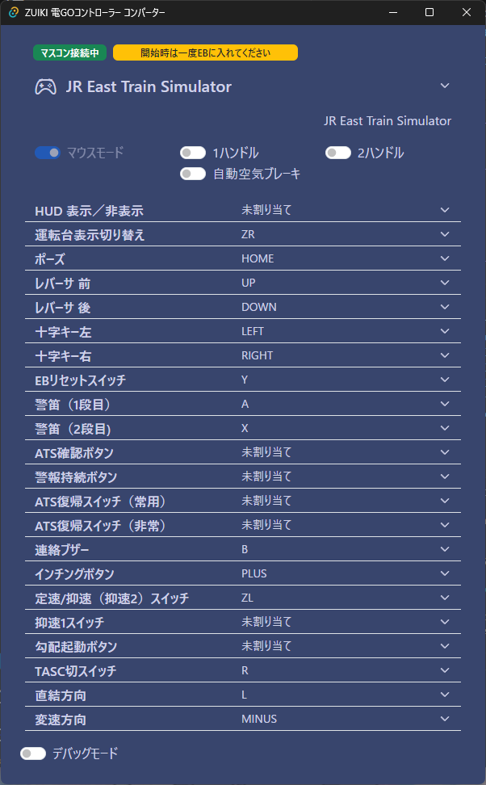

# zuiki-onehandle-mascon-converter

## コンセプト
- マウス、キーボード操作両対応
- メニュー操作などすべてコントローラー側で完結
- キーコンフィグ機能（未実装）
- ゲームパッドのボタン割当（未実装）

## できること
- モードの変更
    - マウスモード(マスコンをマウスで操作する設定、ほとんどの路線で使える)
    - 1ハンドルモード(東海道線、中央線など)
    - 2ハンドルモード(大糸線)
    - 自動空気ブレーキモード(留萠本線)
- キー割り当ての変更
    - 今後変更した割り当てを保存できるように・・したい
- ゲーム内メニューの操作OK
- 警笛など長押しがちゃんと反映される

## 注意点
- Gamepad APIを使用しているため、このツールを最小化した状態では動作しません
- このツールを使用したことによって不利益があったとしても責任はとりかねます
- 初めてアプリ作成に手を出したので、不具合等あるかもしれません
